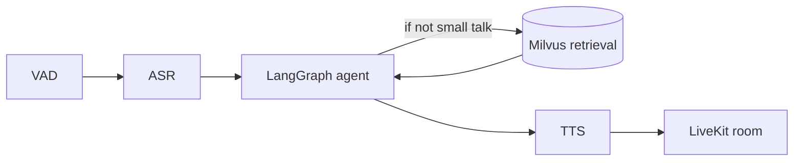

# STE render: voice agent turn pipeline

## Original

A turn starts when VAD detects end-of-speech on the LiveKit audio track; the buffered audio
goes to ASR, the transcript goes to the LangGraph agent, which may call a retrieval tool
against Milvus before producing a reply, and the reply is streamed to TTS whose audio is
published back to the room — retrieval is skipped if the router node classifies the turn as
small talk.

## STE view



A turn starts when VAD finds the end of speech on the LiveKit audio track.

The router node in the LangGraph agent decides if the turn needs retrieval. If the turn is
small talk, the agent does not call Milvus.

## Edges

- VAD sends the buffered audio to ASR.
- ASR sends the transcript to the LangGraph agent.
- The LangGraph agent queries Milvus retrieval, only if the turn is not small talk.
- Milvus retrieval returns results to the LangGraph agent.
- The LangGraph agent streams the reply to TTS.
- TTS publishes audio to the LiveKit room.

## Preserved terms

- LiveKit
- LangGraph
- Milvus

## Claims

```json
[
  {"id": "C1", "claim": "turn starts on VAD end-of-speech", "anchors": ["VAD", "end of speech"]},
  {"id": "C2", "claim": "retrieval is skipped for small talk", "anchors": ["small talk", "Milvus"]},
  {"id": "C3", "claim": "TTS audio is published back to the room", "anchors": ["TTS", "LiveKit room"]}
]
```
